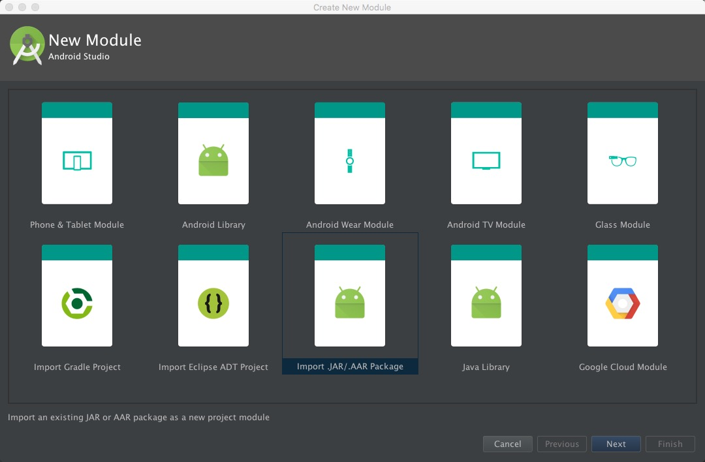
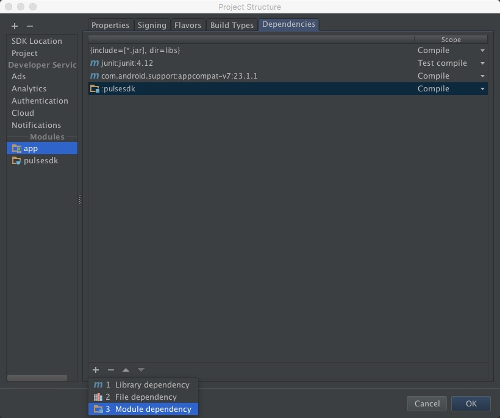
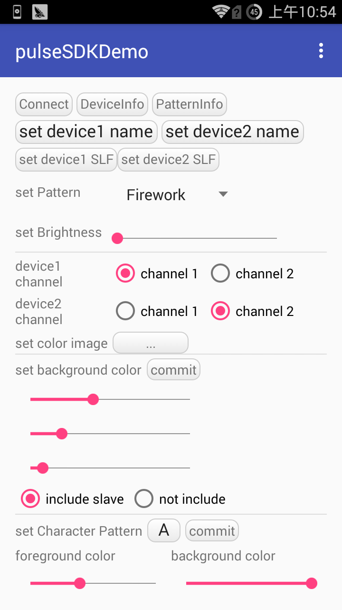
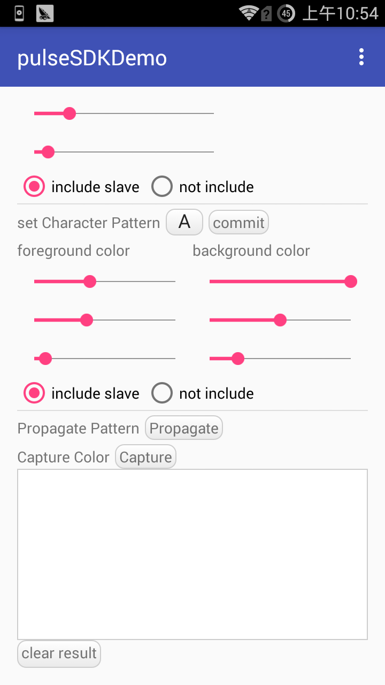

Getting Started Guide (Android)
===============================

The Harman/Kardon Pulse SDK is provided for Android 3rd party developers to communicate with Harman/Kardon Pulse Series audio devices. The intent of this SDK is to provide the tools and libraries necessary to build, test and deploy the latest applications on the Android platform.

Creating a Sample Application
--------------------------------

1. Add library to your project
~~~~~~~~~~~~~~~~~~~~~~~~~~~~~~~~~~~~~~~~~~~~~~~~~

- The step in Android Studio:

Add the libPulseSDK.aar package as library. 

1. Select the menu: File->New->New Module->import aar package. As following:

2. Select the menu: File->Project Structor->app(under Modules)->Dependencies, push +，then File dependency，select HKWirelessHD.jar. As following:

- The step in Eclipse:

You can use the gradle-eclipse-aar-plugin to import the libPulseSDK.aar package

The path in github:
https://github.com/ksoichiro/gradle-eclipse-aar-plugin

2. Import package header
~~~~~~~~~~~~~~~~~~~~~~~~~~~~~~~~~~~~~~~~~~~~~~~~~

Add the package header to your code:

.. code-block:: java

	import com.harman.pulsesdk.DeviceModel;
	import com.harman.pulsesdk.PulseColor;
	import com.harman.pulsesdk.PulseThemePattern;
	import com.harman.pulsesdk.PulseHandlerInterface;
	import com.harman.pulsesdk.PulseNotifiedListener;
	import com.harman.pulsesdk.ImplementPulseHandler;

3. Create PulseSDK Control Handler
~~~~~~~~~~~~~~~~~~~~~~~~~~~~~~~~~~~~~~~~~~~~~~~~~~~~~~~~~~~~~~~~~~~~~~~~~~~~~

All APIs can be accessed through the object pointer of PulseHandler. Only you have to do is create a PulseHandler object use them to invoke the APIs you want to use.

.. code-block:: java

	// Create a PulseHandler instance
	PulseHandlerInterface pulseHander = new ImplementPulseHandler();

4. Create application interface
~~~~~~~~~~~~~~~~~~~~~~~~~~~~~~~~~~~~~~~~~~~~~~~~~~~~~~~~~~~~~~~~~~~~~~~~~~

The app is a simple example. Make a activity with some buttons to control the pulse device.
The interface of app as following:

	

	

5. Connect the pulse
~~~~~~~~~~~~~~~~~~~~~~~~~~~~~~~~~~~~~~~~~~~~~~~~~~~~~~~~~~~~~~~~~~~~~~~~~~

To connect and set the status of pulse, you need to connect one pulse as master device and phone by bluetooth before. If you have slave pulse need to set, you must connect them by BLE using the button on devices. 

.. code-block:: java

	//refresh device button
	  (this.findViewById(R.id.connect_btn)).setOnClickListener(new View.OnClickListener() {
	      @Override
	      public void onClick(View v) {
	      	// connect master device
	          pulseHander.ConnectMasterDevice(this);
	      }
	  });
	  

6. Implement callbacks
~~~~~~~~~~~~~~~~~~~~~~~~~~~~

All the updates from the device and the results of set device are reported to the phone via callbacks. So, you must use corresponding callbacks accordingly.

.. code-block:: java

    pulseHander.registerPulseNotifiedListener(new PulseNotifiedListener() {
	
    @Override
    public void onConnectMasterDevice(){
        Log.i(LOG_TAG, "onConnectMasterDevice");
    }
    
    @Override
    public void onDisconnectMasterDevice(){
        Log.i(LOG_TAG, "onDisconnectMasterDevice");
    }

    @Override
    public void onLEDPatternChanged(PulseThemePattern pattern){
        Log.i(LOG_TAG, "onLEDPatternChanged");
    }
    
    @Override
    public void onRetBrightness(int brightness){
        Log.i(LOG_TAG, "onRetBrightness");
    }
    
    @Override
    public void onRetSetDeviceInfo(boolean ret){
        Log.i(LOG_TAG, "onRetSetDeviceInfo");
    }
    
    @Override
    public void onRetRequestDeviceInfo(DeviceModel[] deviceModel){
        Log.i(LOG_TAG, "onRetRequestDeviceInfo");
    }
    
        
    @Override
    public void onRetSetLEDPattern(boolean ret){
        Log.i(LOG_TAG, "onRetSetLEDPattern");
    }
    
        
    @Override
    public void onRetGetLEDPattern(PulseThemePattern pattern){
        Log.i(LOG_TAG, "onRetGetLEDPattern");
    }
    
    @Override
    public void onSoundEvent(int soundLevel){
        Log.i(LOG_TAG, "onSoundEvent: " + soundLevel);
    }
    
    @Override
    public void onRetCaptureColor(PulseColor capturedColor){
        Log.i(LOG_TAG, "onRetCaptureColor");
    }
    
    @Override
    public void onRetCaptureColor(byte red, byte green, byte blue){
        Log.i(LOG_TAG, "onRetCaptureColor");
    }
	});

7. Set pulse information
~~~~~~~~~~~~~~~~~~~~~~~~~~~~~~~~~~~~~~~~~~~~~~~~~~~~~~~~~~~~~~~~~~~~~

Set pulse name

.. code-block:: java

    EditText.OnEditorActionListener editAction = new EditText.OnEditorActionListener() {
        public boolean onEditorAction(TextView v, int actionId, KeyEvent event) {
            if (actionId == EditorInfo.IME_ACTION_DONE && !v.getText().toString().equals("")) {
                if (v == devicenameId) {
                    pulseHander.SetDeviceName(v.getText().toString(), 0);
                } else if (v == devicenameId1) {
                    pulseHander.SetDeviceName(v.getText().toString(), 1);
                } else if (v == setCharacterTextId) {
                    character = v.getText().toString();
                }
            }
            return false;
        }
    };

Set pulse channel. When you set the master pulse the channel 1, and the channel of slave pluse is set the channel 2 automaticlly.

.. code-block:: java

    RadioGroup.OnCheckedChangeListener radioCheck = new RadioGroup.OnCheckedChangeListener() {
        public void onCheckedChanged(RadioGroup group, int checkedId) {
            if (device1Channel == group)
                pulseHander.SetDeviceChannel(0, checkedId ==device1Channel1.getId() ? 1 : 2);
            else if (device2Channel == group)
                pulseHander.SetDeviceChannel(1, checkedId ==device2Channel1.getId() ? 1 : 2);
            else if (includeSlave == group)
                backSlave = checkedId == includeSlave1.getId() ? true : false;
            else if (includeSlaveG == group)
                patternSlave = checkedId == includeSlave11.getId() ? true : false;
        }
    };
        

8. Set pulse pattern
~~~~~~~~~~~~~~~~~~~~~~~~~~~~~~~~~~~~~~~~~~~~~~~~~~~~~~~~~~~~~~~~~~~~~

Change device LED pattern information.

.. code-block:: java

    AdapterView.OnItemSelectedListener spinnerSelected = new AdapterView.OnItemSelectedListener() {
        public void onItemSelected(AdapterView<?> arg0, View arg1, int arg2, long arg3) {
            pulseHander.SetLEDPattern(PulseThemePattern.values()[arg2]);
        }

        public void onNothingSelected(AdapterView<?> arg0) {

        }

    };

9. Set background color
~~~~~~~~~~~~~~~~~~~~~~~~~~~~~

Set the background color of the master speaker, or the master and all other speakers (slaves) within BLE signal range.

.. code-block:: java

	//Play a audio file from the play list
   SeekBar.OnSeekBarChangeListener seekAction = new SeekBar.OnSeekBarChangeListener() {
        public void onProgressChanged(SeekBar seekBar, int progress, boolean fromUser) {
            if (seekBar == backRedTunner)
                back_r = progress;
            else if (seekBar == backGreenTunner)
                back_g = progress;
            else if (seekBar == backBlueTunner)
                back_b = progress;
        }

        public void onStartTrackingTouch(SeekBar seekBar) {

        }

        public void onStopTrackingTouch(SeekBar seekBar) {

        }
    };

    @Override
    public void onClick(View v) {
        switch (v.getId()) {
            case R.id.setBackColorId:
                pulseHander.SetBackgroundColor(new PulseColor(back_r, back_g, back_b), backSlave);
                break;
        }
    }

10. Show Charactor pattern
~~~~~~~~~~~~~~~~~~~~~~~~~~~~~~~~

Set a Character pattern to master speaker.

.. code-block:: java

   SeekBar.OnSeekBarChangeListener seekAction = new SeekBar.OnSeekBarChangeListener() {
        public void onProgressChanged(SeekBar seekBar, int progress, boolean fromUser) {
            if (seekBar == backRedTunnerP)
                back_r_p = progress;
            else if (seekBar == backGreenTunnerP)
                back_g_p = progress;
            else if (seekBar == backBlueTunnerP)
                back_b_p = progress;
            else if (seekBar == foreRedTunner)
                fore_r = progress;
            else if (seekBar == foreRedTunner)
                fore_g = progress;
            else if (seekBar == foreRedTunner)
                fore_b = progress;
        }

        public void onStartTrackingTouch(SeekBar seekBar) {

        }

        public void onStopTrackingTouch(SeekBar seekBar) {

        }
    };
    
   @Override
    public void onClick(View v) {
        switch (v.getId()) {
            case R.id.setCharacterId:
                character = setCharacterTextId.getText().toString();
                if(!character.isEmpty())
                pulseHander.SetCharacterPattern(character.charAt(0),
                        new PulseColor(fore_r, fore_g, fore_b),
                        new PulseColor(back_r_p, back_g_p, back_b_p),
                        patternSlave);
                break;
        }
    }
    
    
    
11. Set brightness
~~~~~~~~~~~~~~~~~~~~~~~~

Change device LED brightness.

.. code-block:: java

   SeekBar.OnSeekBarChangeListener seekAction = new SeekBar.OnSeekBarChangeListener() {
        public void onProgressChanged(SeekBar seekBar, int progress, boolean fromUser) {
            if (seekBar == setBrightId)
                pulseHander.SetBrightness(progress);
        }

        public void onStartTrackingTouch(SeekBar seekBar) {

        }

        public void onStopTrackingTouch(SeekBar seekBar) {

        }
    };
 
    
12. Show image
~~~~~~~~~~~~~~~~~~~~~~~~

Send 9x11 color bitmap to Pulse.

.. code-block:: java

    @Override
    public void onClick(View v) {
        switch (v.getId()) {
            case R.id.setColorImageId:
                PulseColor[] pixes = new PulseColor[99];
                for (int i = 0; i < 99; i++) {
                	//set image by yourself
                	pixes[i] = new PulseColor(255, 255, 255);
                }
                pulseHander.SetColorImage(pixes);
                break;
        }
    }
    
    
13. Get color by color picker
~~~~~~~~~~~~~~~~~~~~~~~~~~~~~~~~

When you click the button of Color Picker on device and focus on some place, the function will provide the color from the picker.

.. code-block:: java

    public void onRetCaptureColor(PulseColor capturedColor) {
        Log.i("hello", "onRetCaptureColor");
        optResId.append("onRetCaptureColor: red=" + capturedColor.red + " green=" + capturedColor.green + " blue=" + capturedColor.blue + "\n");

    }

    public void onRetCaptureColor(byte red, byte green, byte blue) {
        Log.i("hello", "onRetCaptureColor");
        optResId.append("onRetCaptureColorRGB: red=" + red + " green=" + green + " blue=" + blue + "\n");
    }